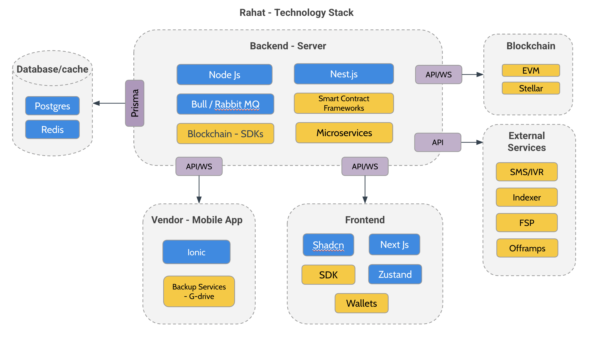

# 🏗️ Architecture Overview

:::tip What is Rahat Platform?
The **Rahat Platform** is a modular and extensible foundation for building humanitarian aid and financial inclusion projects using blockchain. It provides a common infrastructure layer that handles identity, authorization, wallet provisioning, transaction coordination, and communications—allowing individual projects to focus solely on their domain-specific logic.
:::

## 🔄 Platform + Projects Model

At a high level, the architecture follows a **platform + projects** model:

🏢 **Rahat Platform**
- Provides core services and interfaces that power the ecosystem
- Manages fundamental infrastructure components
- Ensures security and reliability

🔌 **Projects**
- Act like independent **microservices**
- Built on top of the platform
- Each represents a specific use case (e.g., cash assistance, anticipatory action, voucher distribution)

## 🤝 Platform and Project Relationship

Rahat is designed to support multiple types of projects running concurrently within the same environment. These projects share common infrastructure but can have different flows, rules, and modules.

<b>💡 Key Features</b>

* The **platform** handles:
  - 🔐 Authentication
  - 👝 Wallet management
  - ⛓️ Blockchain orchestration
  - 📊 Data indexing

* **Projects** capabilities:
  - 🔄 Consume platform services
  - 🧩 Inherit shared components
  - ⚙️ Implement custom logic
  - 🎨 Create unique interfaces

## 🏛️ Architecture Structure (WIP)

:::info Architecture Diagram
The following diagram illustrates the high-level architecture of the Rahat platform and its core components.
:::

The Platform Core acts as the central gateway and foundation for the entire Rahat ecosystem. All client applications (frontend, mobile) and external integrations connect through the Platform Core, which then coordinates with various microservices and smart contracts to fulfill requests.
## 🎯 Design Principles

| Principle | Description |
|-----------|-------------|
| **🧩 Modularity** | Projects are plug-and-play; reuse or extend platform services |
| **🎨 Customizability** | Build and deploy your own project types using Rahat SDK and APIs |
| **📈 Scalability** | Onboard new projects without modifying the core platform |
| **🔄 Separation of Concerns** | Core platform manages infrastructure; projects manage business logic |

## 💻 Technology Stack

### 🔧 Backend
- **Runtime**: Node.js with Nest.js framework
- **Database**: Prisma ORM for efficient data operations
- **API Style**: RESTful + GraphQL endpoints

### 🎨 Frontend
- **Framework**: Next.js with Shadcn
- **State Management**: Zustand
- **UI/UX**: Modern, responsive design

### 🗄️ Data Layer
- **Database**: PostgreSQL
- **Caching**: Redis
- **Message Queue**: RabbitMQ

### ⛓️ Blockchain
- **Networks**: 
  - EVM-compatible chains
  - Stellar
  - Aptos
- **Features**: Smart contracts, wallets, transactions

### 📱 Mobile
- **Framework**: Ionic
- **Platform**: Cross-platform support
- **Integration**: Native blockchain features

:::info
Want to learn more about implementing specific features or integrating with the platform? Check out our [Development Guide](../Development-Guide/01.Smart-Contract-Deployment.md).
:::
