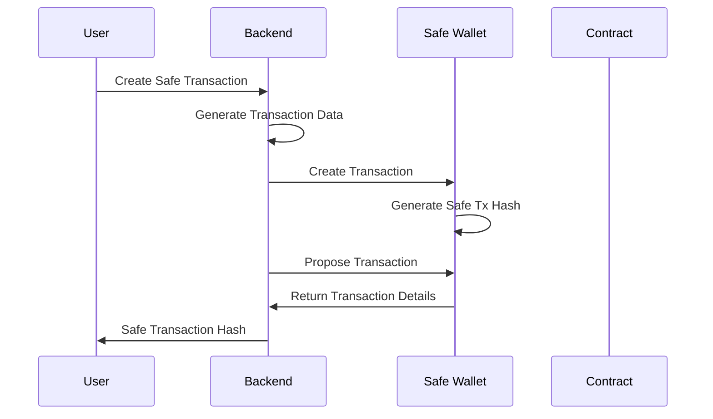
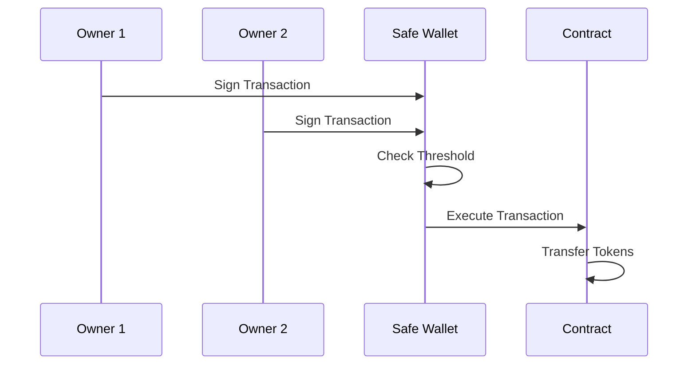
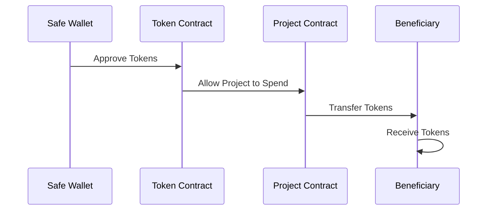

# Multisig Disbursement

## Overview

The Rahat Project C2C implements a robust multisig disbursement system using **Gnosis Safe** to ensure secure, transparent, and auditable token transfers. This system requires multiple approvals before executing disbursements, providing enhanced security for humanitarian aid and development project funding.

## Architecture

### Core Components

1. **Gnosis Safe Protocol**: Multi-signature wallet implementation
2. **Safe API Kit**: Integration with Safe's transaction management
3. **Safe Protocol Kit**: Core SDK for Safe operations
4. **DisbursementMultisigService**: Backend service handling multisig operations

### Technology Stack

- **Safe Protocol**: `@safe-global/protocol-kit`
- **Safe API**: `@safe-global/api-kit`
- **Ethers.js**: Blockchain interaction
- **NestJS**: Backend framework
- **Prisma**: Database ORM

## Implementation Details

### 1. DisbursementMultisigService

The core service handling all multisig operations:

```typescript
@Injectable()
export class DisbursementMultisigService {
  private safeApiKit: SafeApiKit;
  
  constructor(protected prisma: PrismaService) {
    this.safeApiKit = new SafeApiKit({
      chainId: BigInt(process.env.CHAIN_ID),
    });
  }
}
```

### 2. Key Methods

#### Generate Transaction Data
```typescript
async generateTransactionData(amount: string) {
  const CONTRACT = await this.prisma.setting.findUnique({
    where: { name: 'CONTRACT' }
  });
  
  const c2cAddress = CONTRACT.value['C2CPROJECT']['ADDRESS'];
  const tokenAddress = CONTRACT.value['RAHATTOKEN']['ADDRESS'];
  
  const tokenContract = new ethers.Contract(
    tokenAddress,
    erc20Abi,
    new JsonRpcProvider(process.env.NETWORK_PROVIDER)
  );
  
  const decimals = await tokenContract.decimals();
  const tokenApprovalEncodedData = tokenContract.interface.encodeFunctionData(
    'approve',
    [c2cAddress, ethers.parseUnits(amount, decimals)]
  );
  
  const safeTransactionData: MetaTransactionData = {
    to: tokenAddress,
    value: '0',
    data: tokenApprovalEncodedData,
    operation: OperationType.Call,
  };
  
  return safeTransactionData;
}
```

#### Create Safe Transaction
```typescript
async createSafeTransaction(payload: CreateSafeTransactionDto) {
  const transactionData = await this.generateTransactionData(payload.amount);
  const safeWallet = await this.getSafeInstance();
  
  const safeTransaction = await safeWallet.createTransaction({
    transactions: [transactionData],
  });
  
  const safeTxHash = await safeWallet.getTransactionHash(safeTransaction);
  const signature = await safeWallet.signHash(safeTxHash);
  
  await this.safeApiKit.proposeTransaction({
    safeAddress: safeAddress,
    safeTransactionData: safeTransaction.data,
    safeTxHash,
    senderAddress: deployerWallet.address,
    senderSignature: signature.data,
  });
  
  return {
    safeAddress,
    safeTransactionData: safeTransaction.data,
    safeTxHash,
    senderAddress: deployerWallet.address,
    senderSignature: signature.data,
  };
}
```

## Workflow

### 1. Transaction Creation



### 2. Approval Process



### 3. Transaction Execution



## API Endpoints

### 1. Create Safe Transaction

**Endpoint**: `POST /safe-transaction/create`

**Request**:
```json
{
  "amount": "100"
}
```

**Response**:
```json
{
  "safeAddress": "0x...",
  "safeTransactionData": "0x...",
  "safeTxHash": "0x...",
  "senderAddress": "0x...",
  "senderSignature": "0x..."
}
```

### 2. Get Transaction Approvals

**Endpoint**: `GET /safe-transaction/approvals`

**Request**:
```json
{
  "transactionHash": "0x..."
}
```

**Response**:
```json
{
  "approvals": [
    {
      "owner": "0x...",
      "submissionDate": "2024-01-01T00:00:00Z",
      "hasApproved": true
    }
  ],
  "confirmationsRequired": 2,
  "isExecuted": false,
  "proposer": "0x..."
}
```

### 3. Get Pending Transactions

**Endpoint**: `GET /safe-transaction/pending`

**Response**:
```json
{
  "results": [
    {
      "safeTxHash": "0x...",
      "to": "0x...",
      "value": "0",
      "data": "0x...",
      "operation": 0,
      "gasToken": "0x0000000000000000000000000000000000000000",
      "safeTxGas": 0,
      "baseGas": 0,
      "gasPrice": "0",
      "refundReceiver": "0x0000000000000000000000000000000000000000",
      "nonce": 0,
      "executionDate": null,
      "submissionDate": "2024-01-01T00:00:00Z",
      "modified": "2024-01-01T00:00:00Z",
      "blockNumber": null,
      "transactionHash": null,
      "safeApp": null,
      "confirmations": [],
      "signatures": null,
      "detailedExecutionInfo": null
    }
  ]
}
```

## Configuration

### Environment Variables

```bash
# Safe Configuration
SAFE_WALLET_ADDRESS=0x...
DEPLOYER_PRIVATE_KEY=0x...
CHAIN_ID=84532
NETWORK_PROVIDER=https://sepolia.base.org

# Contract Addresses
CONTRACT_C2CPROJECT=0x...
CONTRACT_RAHATTOKEN=0x...
```

### Database Settings

The system stores Safe configuration in the database:

```sql
-- Safe Wallet Configuration
INSERT INTO tbl_settings (name, value, dataType) VALUES (
  'SAFE_WALLET',
  '{"ADDRESS": "0x..."}',
  'OBJECT'
);

-- Contract Configuration
INSERT INTO tbl_settings (name, value, dataType) VALUES (
  'CONTRACT',
  '{
    "C2CPROJECT": {"ADDRESS": "0x..."},
    "RAHATTOKEN": {"ADDRESS": "0x..."}
  }',
  'OBJECT'
);
```

## Security Features

### 1. Multi-Signature Requirements

- **Threshold Configuration**: Configurable number of required signatures
- **Owner Management**: Add/remove Safe owners
- **Time Locks**: Optional time delays for large transactions

### 2. Transaction Validation

- **Balance Checks**: Verify sufficient token balance
- **Contract Validation**: Ensure contract addresses are correct
- **Gas Estimation**: Calculate required gas for execution

### 3. Audit Trail

- **Transaction History**: Complete record of all transactions
- **Approval Tracking**: Track who approved each transaction
- **Execution Logs**: Detailed execution information

## Use Cases

### 1. Humanitarian Aid Distribution

**Scenario**: NGO distributing emergency aid to disaster victims

**Workflow**:
1. **Project Setup**: Configure Safe with NGO representatives as owners
2. **Beneficiary Registration**: Enroll affected individuals
3. **Disbursement Creation**: Create multisig transaction for token transfer
4. **Multi-Party Approval**: Require approval from multiple NGO officials
5. **Execution**: Execute transaction after sufficient approvals
6. **Verification**: Track all transactions on blockchain

### 2. Development Project Funding

**Scenario**: Government agency managing development grants

**Workflow**:
1. **Grant Allocation**: Set up Safe with government officials
2. **Milestone Tracking**: Link disbursements to project milestones
3. **Approval Workflow**: Require approvals from different departments
4. **Transparent Execution**: Execute transfers with full audit trail

### 3. Microfinance Operations

**Scenario**: Microfinance institution providing loans

**Workflow**:
1. **Loan Approval**: Create Safe transaction for loan disbursement
2. **Credit Committee**: Require approvals from credit committee members
3. **Risk Management**: Implement additional checks for large amounts
4. **Repayment Tracking**: Monitor loan repayments through blockchain

## Integration with Frontend

### 1. Transaction Creation

```typescript
// Frontend code to create Safe transaction
const createSafeTransaction = async (amount: string) => {
  const response = await fetch('/api/safe-transaction/create', {
    method: 'POST',
    headers: { 'Content-Type': 'application/json' },
    body: JSON.stringify({ amount })
  });
  
  const transaction = await response.json();
  return transaction;
};
```

### 2. Transaction Monitoring

```typescript
// Monitor transaction status
const getTransactionStatus = async (safeTxHash: string) => {
  const response = await fetch(`/api/safe-transaction/approvals`, {
    method: 'POST',
    headers: { 'Content-Type': 'application/json' },
    body: JSON.stringify({ transactionHash: safeTxHash })
  });
  
  const status = await response.json();
  return status;
};
```

### 3. Safe Wallet Integration

```typescript
// Connect to Safe wallet
import Safe from '@safe-global/protocol-kit';

const connectToSafe = async (safeAddress: string) => {
  const safe = await Safe.init({
    provider: window.ethereum,
    signer: window.ethereum.getSigner(),
    safeAddress
  });
  
  return safe;
};
```

## Error Handling

### Common Error Scenarios

1. **Insufficient Balance**
   ```json
   {
     "error": "Insufficient token balance",
     "code": "INSUFFICIENT_BALANCE",
     "required": "1000",
     "available": "500"
   }
   ```

2. **Insufficient Approvals**
   ```json
   {
     "error": "Insufficient approvals",
     "code": "INSUFFICIENT_APPROVALS",
     "required": 2,
     "received": 1
   }
   ```

3. **Transaction Failed**
   ```json
   {
     "error": "Transaction execution failed",
     "code": "EXECUTION_FAILED",
     "reason": "Gas limit exceeded"
   }
   ```

### Error Recovery

1. **Retry Mechanism**: Automatic retry for failed transactions
2. **Gas Adjustment**: Dynamic gas estimation and adjustment
3. **Fallback Options**: Alternative execution paths for failed transactions

## Monitoring and Analytics

### 1. Transaction Metrics

- **Success Rate**: Percentage of successful transactions
- **Average Approval Time**: Time from creation to execution
- **Gas Usage**: Average gas consumption per transaction
- **Owner Activity**: Frequency of approvals per owner


### 3. Alert System

- **Threshold Alerts**: Notify when approval threshold is reached
- **Execution Alerts**: Notify when transactions are executed
- **Error Alerts**: Notify when transactions fail

## Best Practices

### 1. Safe Configuration

- **Owner Diversity**: Use multiple independent owners
- **Threshold Setting**: Set appropriate approval thresholds
- **Time Locks**: Implement time locks for large transactions
- **Emergency Procedures**: Plan for emergency situations

### 2. Transaction Management

- **Batch Transactions**: Group related transactions when possible
- **Gas Optimization**: Optimize gas usage for cost efficiency
- **Regular Monitoring**: Monitor transaction status regularly
- **Backup Procedures**: Maintain backup execution procedures

### 3. Security Considerations

- **Private Key Management**: Secure storage of private keys
- **Access Control**: Limit access to Safe operations
- **Audit Logging**: Maintain comprehensive audit logs
- **Regular Reviews**: Regular security reviews and updates

## Troubleshooting

### Common Issues

1. **Transaction Stuck**
   - Check gas prices and adjust if necessary
   - Verify all required approvals are received
   - Check for network congestion

2. **Approval Issues**
   - Verify owner addresses are correct
   - Check signature validity
   - Ensure proper threshold configuration

3. **Contract Integration**
   - Verify contract addresses are correct
   - Check contract permissions and allowances
   - Validate transaction data format


