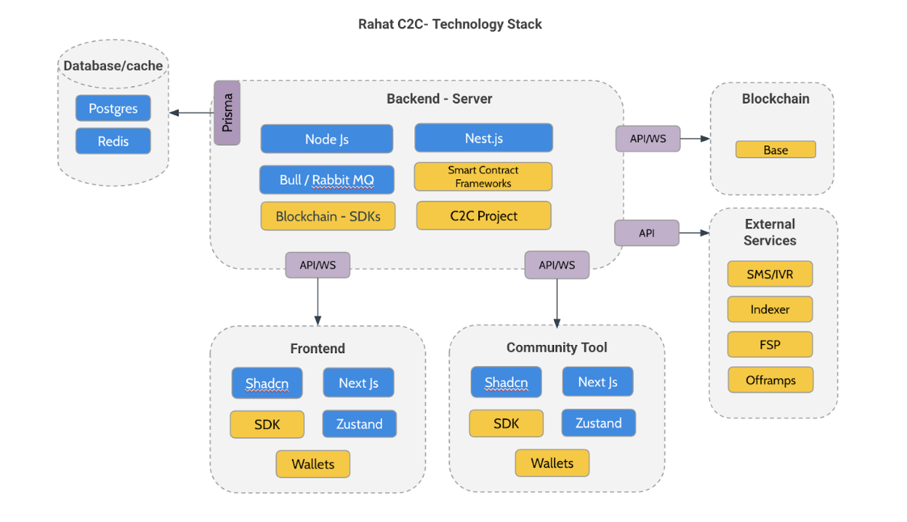
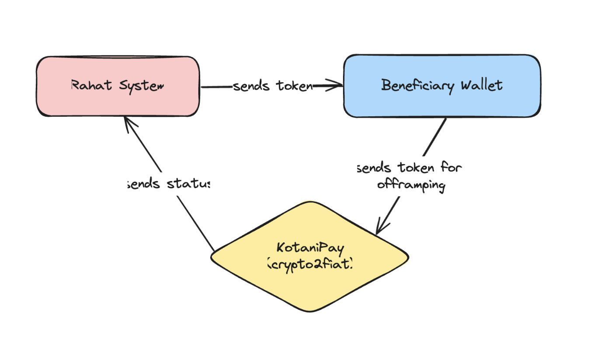
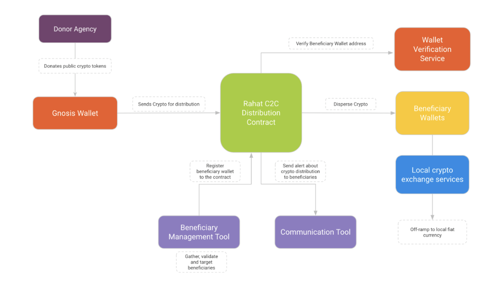

# Architecture and tech stack

## High Level Diagram of System

Core Technology Stack

| Component             | Technology            | Purpose                                           |
|-----------------------|-----------------------|---------------------------------------------------|
| Backend Microservice  | NestJs                | Main application server, REST API endpoints       |
| Database              | PostgreSQL + Prisma   | Data persistence and type-safe queries            |
| Smart Contracts       | Solidity + Hardhat    | Blockchain interaction and business logic         |
| Indexing              | The Graph             | Blockchain data indexing and GraphQL API          |
| Containerization      | Docker                | Application containerization and deployment       |
| MultiSig              | Safe/Gnosis           | Wallet for the MultiSig operations                |
| Offramping Service    | KotaniPay             | Offramping Service for crypto conversion to fiat  |

## Folder Structure

rahat-project-c2c/
├── .github/               # CI workflows, issue/pr templates
├── abis/                  # Auto-generated contract ABIs
├── apps/
│   ├── c2c/               # Frontend app for C2C dashboard (React + Nx)
│   ├── c2c-e2e/           # Cypress-based end-to-end tests
│   ├── contracts/         # Hardhat smart-contract project
│   ├── graph/             # Subgraph mappings & schema
│   └── graph-old/         # Legacy subgraph (archived)
├── docs/                  # Architecture docs, design specs
└── libs/                  # Shared packages (contract types, extensions, react-query hooks...)
