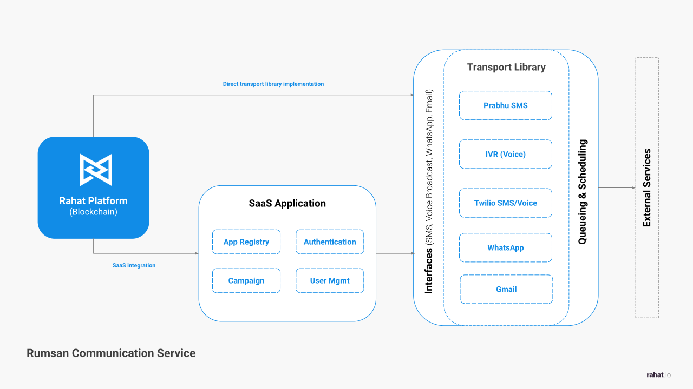

# Communication Tool

## Introduction

RS Communication Tool is application that integrates various external services and
provides a unified interface to interact with them. It can be implemented as a
standalone application or as a library. Here are few service types that can be
integrated with RS Communications:

- Email
- SMS
- Push Notifications
- WhatsApp
- Voice Broadcast
- Interactive Voice Response (IVR)

## System Architecture

RS Communications is designed to be modular and extensible. Each external
service is registered as transport implementing a common interface. It
encaupsulates the logic and authentication secrets to interact with the external
service. The application can be configured to use one or more transports to send
messages.



## Input Interface

To broadcast messages to the intended audience, RS Comms implements standard
interface to receive instruction. This instrution is then processed by the
application to send messages using the configured transports. Here is the
specification for the inststruction template:

```typescript
{
  transport: {
    type: "email" | "sms" | "whatsapp" | "voice",
    subject?: string,
    message?: string,
    fileUrl?: string,
    extras?: Record<string, any>
  },
  audience: string []  //address - email, phone number, whatsapp number
  options: {
    trigger: "immediate" | "scheduled" | "manual",
    scheduledTimestamp?: Date,
    retries: number, //default:0
    retryIntervalMinutes?: string, //default: 60 or 15,60,120,240
    webhookUrl?: string
  }
}
```

Once the system recevies the instruction, several steps are taken to process the
instruction and send intended messages to the audience. The steps are as
follows:

1. Validate the instruction. Ensure that the instruction is well-formed and
   contains all the required fields. Validation is provided by each transport.
2. If the instruction is valid, RS Comms creates a session with unique UUID
   (SessionId).
3. The session is stored in the database for tracking and logging purposes.
4. The instruction is processed by the application and added to transport queue.
5. The transport queue is processed by the transport worker or external service
   api to send messages to the intended audience.
6. Once the message is processed, post processing happens updating logs or
   calling webhook.

### Example Data

Here is the sample data. This data can be used to send voice broadcast message
to the audience of 7 phone numbers in Nepal. The message is scheduled to be sent
after 5 days.

```json
{
  "transport": {
    "type": "voice",
    "message": "Hello, this is a test message from RS Comms.",
    "fileUrl": "https://example.com/voice.mp3"
  },
  "audience": [
    "+9779812345678",
    "+9779812345679",
    "+9779812345680",
    "+9779812345681",
    "+9779812345682",
    "+9779812345683",
    "+9779812345684"
  ],
  "options": {
    "trigger": "scheduled",
    "scheduledTimestamp": "2021-12-31T23:59:59",
    "retries": 3,
    "retryIntervalMinutes": "60,180,600",
    "webhookUrl": "https://example.com/webhook"
  }
}
```

Detailed Implementation documents will be updated soon. Stay tuned!